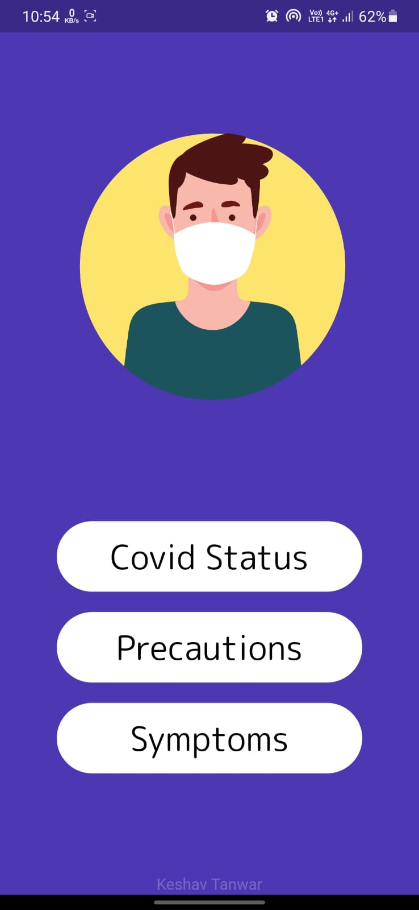

<h1> Covid-Tracker</h1>
<table width: "100%">
  <td>
  
  </td>
  <td width: "70%">
    <h1> Covid-Tracker</h1>
    
Get covid stats of your region within seconds and get updated with all the precautions and symptoms of Covid.

  </td>

</table>

### Screenshots from the app
<table style="width:100%">
 <th>

  </th>
 <th>

  </th>

 <th>

  </th>

 <th>

  </th>
</table>

## 💡 Inspiration
### We all have been affected by the current COVID-19 pandemic. However, the impact of the pandemic and its consequences are felt differently depending on our status as individuals and as members of society. While some try to adapt to working online, homeschooling their children and ordering food via Instacart, others have no choice but to be exposed to the virus while keeping society functioning. Our different social identities and the social groups we belong to determine our inclusion within society and, by extension, our vulnerability to epidemics. Prier this application it was a bit tedious to get the status of covid-19 cases stats of your region, earlier users had to search it on Google go through several websites then the user might get the correct stats with this I tried to solve this problem this is simple and easy to use the app. User can select their region and within seconds get stats of their local region.
## 🧑‍💻 Working
### This app is developed using flutter and dart. This app uses HTTP package and fetches all the data of different regions with the help of covid API.

##  ⚙️ Tools and Technologies Used
## 🔽 Download the App from here
<a href="https://drive.google.com/drive/folders/1W-IjDzXX-6sUpev2aWBctajaIF2W7jtZ?usp=sharing">Click Here</a>
