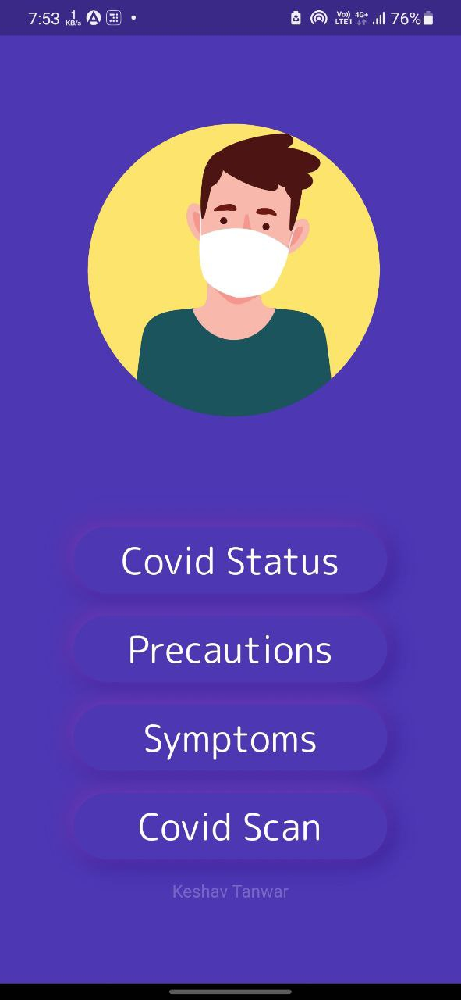
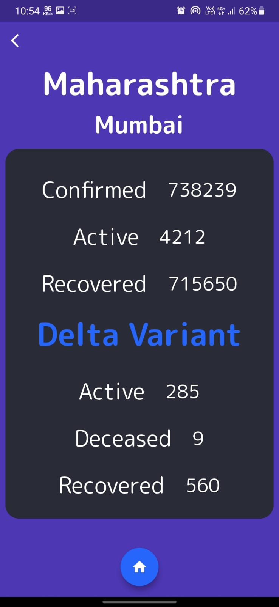
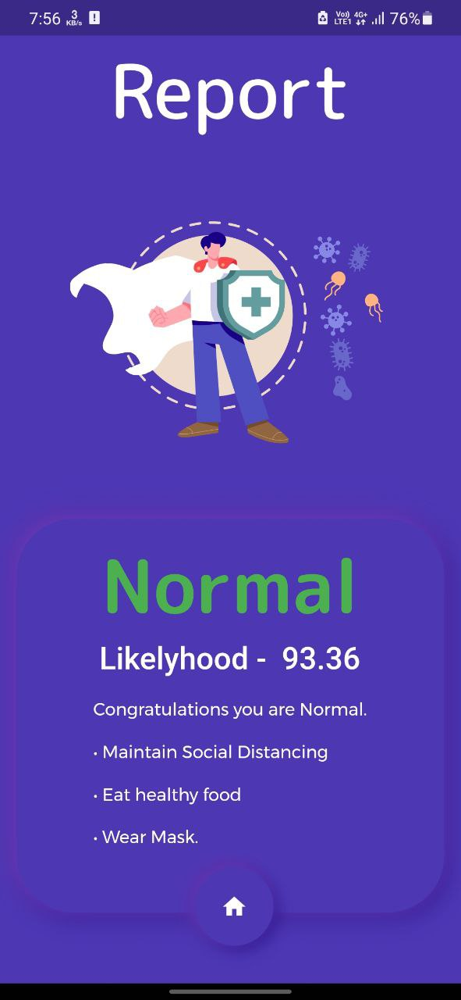

<h1> Covid-Tracker</h1>
<table width: "100%">
<!--   <td>
  
  </td> -->
  <td>
  
  </td>
  <td>
    <h1> Covid-Tracker</h1>
    
Get covid report and covid stats of your region within seconds and get updated with all the precautions and symptoms of Covid.

  </td>

</table>

### Screenshots from the app
<table style="width:100%">
 <th>

  </th>
 <th>

  </th>

 <th>

  </th>

 <th>

  </th>
  <th>

  </th>
  <th>

  </th>
</table>

## 🔽 Download the App <a href="https://drive.google.com/drive/folders/1W-IjDzXX-6sUpev2aWBctajaIF2W7jtZ?usp=sharing">Click Here</a>

## 🔽 Developed API documentaion <a href="https://covid-classifier-api.herokuapp.com/docs">Click Here</a>

## 🔽 Web App <a href="https://covid-classifier-webapp.herokuapp.com/">Click Here</a>

## 💡 Inspiration
### We all have been affected by the current COVID-19 pandemic some try to adapt to working online, others have no choice but to be exposed to the virus while keeping society functioning which results in a rise of covid cases, and at the same time pneumonia cases were also rising so it becomes even more difficult to distinguish between covid and pneumonia symptoms. There was a shortage of working medical professionals as well so I developed this application where users can upload their x chest rays in the app, with the help of deep learning the app tells you whether you are infected with the covid virus or not and the app also tells about the covid cases in user's vicinity.

## 🧑‍💻 Working
### This app is developed using flutter and dart. This app uses the HTTP and Dio package and fetches all the data of different regions with the help of covid API. The app uses a deep learning model (developed using TensorFlow, Keras, and python) for chest x-ray classification into covid, normal and viral Pneumonia. The deep learning model is deployed with the help of fastAPI.

##  ⚙️ Tools and Technologies Used

